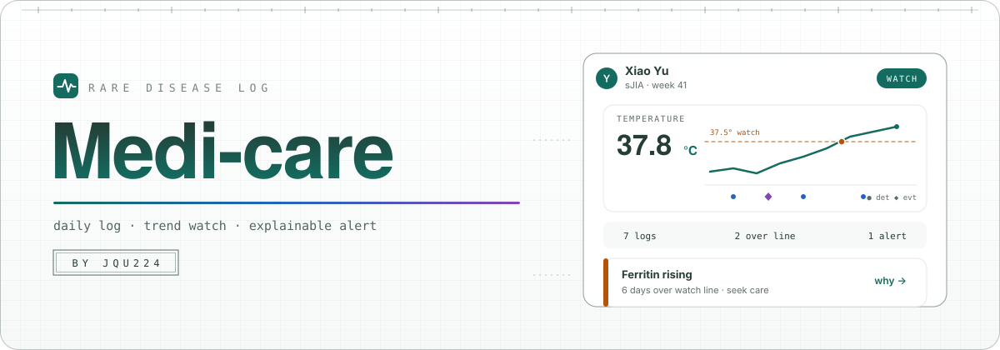

<div align="center">

</div>

<div align="center">
<pre>~/medi-care (main*)  19 tests  port 7100</pre>
</div>

<div align="center">

[](README.md)
[](README.zh-CN.md)

</div>

<div align="center">

[](https://github.com/jqu224/medi-care/releases/latest)
[](https://github.com/jqu224/medi-care/releases)

[](LICENSE)
[](https://github.com/jqu224/medi-care/stargazers)

</div>

## medi-care

Daily logs and explainable trend alerts for rare-disease care.

— Patient, family, and clinician views over one local demo dataset.

[](app/package.json)
[](app/package.json)
[](app/tests/model.test.ts)
[](app/README.md)

A mobile-first web app for recording symptoms, temperature, and medication, then showing why a trend crossed a watch line.

**Tips for getting started**

1. Read this page for who uses the app.
2. From `app/`, install dependencies and start the Vite dev server on port `7100`.
3. `npm test` runs the model checks. The running app keeps demo records in this browser's `localStorage`.

---

## Positioning

| | |
| --- | --- |
| **Who** | A patient recording their own day, a family member switching among demo patients, a clinician reading the same record |
| **Job** | Log the day in a few taps, see the trend, and read the reason when a value stays over a line |
| **Boundary** | Auxiliary watch tool. It does not diagnose, and the demo patients are fictional |

## Pipeline

```text
observation → shared metrics → watch rules → alert with a reason
patient / family write          clinician reads
```

| Step | What it does | Gate |
| --- | --- | --- |
| 1. Log | Append temperature, symptoms, medication, and events for the signed-in patient | A patient write cannot land on another patient |
| 2. Metrics | Keep shared series as one source across day, week, and month views | Empty periods stay empty |
| 3. Watch | Apply the configured disease rules, including sJIA / MAS trend checks | Non-clinical presets and paused monitors do not inherit MAS alerts |
| 4. Explain | Show the value, the line it crossed, how long it lasted, and the suggested next step | Clinician role is read-only |

## Repository layout

| Path | Role |
| --- | --- |
| `app/` | React 19 + TypeScript + Vite workspace |
| `app/tests/model.test.ts` | 14 model tests |
| `mvp/` | Earlier static mock |
| `docs/assets/hero.svg` | README banner |

## Contract

| Rule | Meaning |
| --- | --- |
| Fictional demo | Seed patients and passwords exist only for the local demo |
| No diagnosis copy | The UI asks the reader to seek care. It does not name a diagnosis |
| One browser | Records stay in `localStorage` on this device |
| Clinician | Can switch patients and cannot write |

## Usage

```bash
cd app
npm install
npm run dev
npm test
npm run build
npm run lint
```

| Command | Result |
| --- | --- |
| `npm run dev` | Dev server at http://127.0.0.1:7100 |
| `npm test` | Bundles `tests/model.test.ts` and runs Node's test runner |
| `npm run build` | Typecheck and Vite build into `app/dist/` |
| First visit | Pick patient, family, or clinician. The screen shows the demo password for that role |

## License

[MIT](LICENSE)
